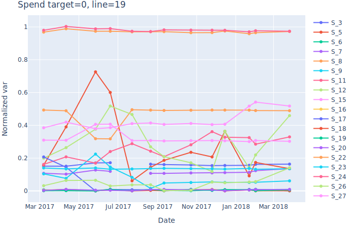

# American Express - Default Prediction

- [American Express - Default Prediction](#american-express---default-prediction)
  - [1. Abstract](#1-abstract)
  - [2. Data](#2-data)
  - [3. feather 形式に変換](#3-feather-形式に変換)
  - [4. データの概観](#4-データの概観)
    - [4.1. 明細数の確認](#41-明細数の確認)
    - [4.2. カテゴリ別に target を比較](#42-カテゴリ別に-target-を比較)

---

## 1. Abstract

> Whether out at a restaurant or buying tickets to a concert, modern life counts on the convenience of a credit card to make daily purchases. It saves us from carrying large amounts of cash and also can advance a full purchase that can be paid over time. How do card issuers know we’ll pay back what we charge? That’s a complex problem with many existing solutions—and even more potential improvements, to be explored in this competition.
> Credit default prediction is central to managing risk in a consumer lending business. Credit default prediction allows lenders to optimize lending decisions, which leads to a better customer experience and sound business economics. Current models exist to help manage risk. But it's possible to create better models that can outperform those currently in use.
> American Express is a globally integrated payments company. The largest payment card issuer in the world, they provide customers with access to products, insights, and experiences that enrich lives and build business success.
> In this competition, you’ll apply your machine learning skills to predict credit default. Specifically, you will leverage an industrial scale data set to build a machine learning model that challenges the current model in production. Training, validation, and testing datasets include time-series behavioral data and anonymized customer profile information. You're free to explore any technique to create the most powerful model, from creating features to using the data in a more organic way within a model.
> If successful, you'll help create a better customer experience for cardholders by making it easier to be approved for a credit card. Top solutions could challenge the credit default prediction model used by the world's largest payment card issuer—earning you cash prizes, the opportunity to interview with American Express, and potentially a rewarding new career.

## 2. Data

目的は月々の顧客プロファイルに基づいて、将来のクレジットカードの支払い滞納を予測すること。ターゲットの二値は最新の明細から 18 ヵ月のパフォーマンスウィンドウを観察することによって計算され、そしてもし顧客が最新の明細から 120 日以内に支払いをしなかった場合、デフォルトイベントとみなす。
データセットは明細日付で各顧客ごとに集約されたプロファイル特徴を含む。特徴は匿名化標準化されそして、次の一般的なカテゴリーに落とし込まれる。

-   `D_*` =Delinquency variables 延滞変数
-   `S_*` =Spend variables 支出変数
-   `P_*` =Payment variables 支払変数
-   `B_*` =Balance variables バランス変数
-   `R_*` =Risk variables リスク変数

次の特徴はカテゴリーに分類される。
`['B_30', 'B_38', 'D_114', 'D_116', 'D_117', 'D_120', 'D_126', 'D_63', 'D_64', 'D_66', 'D_68']`
あなたの仕事はそれぞれの`customer_ID`について将来のデフォルトを`target=1`で予測すること。

-   `train_data.csv` <font color="red"><b>(16.39GB)</b></font>顧客ごとの明細データを持つ学習データ
-   `train_labels.csv` <font color="red">(30.75MB)</font>`customer_ID`ごとの`target`ラベル
-   `test_data.csv` <font color="red"><b>(33.82GB)</b></font>テストデータ;`customer_ID`ごとに`target`を予測する
-   `sample_submission.csv` <font color="red">(61.95MB)</font>正しい形式の提出サンプル

## 3. feather 形式に変換

[What is feather?](https://www.rstudio.com/blog/feather/)

> Feather: A Fast On-Disk Format for Data Frames for R and Python, powered by Apache Arrow

CSV データが重すぎて、このまま`read_csv`するとメモリが飛ぶ。そこで軽量な feather 形式に変換する。ついでに、データ型も換えておく。

@import "..\Development\convert_to_feather.py"

2 時間ぐらいかかった。

-   `train_data.csv` (16.39GB) -> ftr:**1.67GB**
-   `test_data.csv` (33.82GB) -> ftr:**3.44GB**

`pandas`で`to_feather`するには以下のライブラリが必要

```bash
Package           Version
----------------- -----------
pandas            1.4.2
pyarrow           8.0.0
```

## 4. データの概観

### 4.1. 明細数の確認

<div align= "center">


`顧客単位の明細データ数`

</div>

<div align= "center">


`拡大`

</div>

### 4.2. カテゴリ別に target を比較

<div class="block_all">
<div class="block_left">

<div align= "center">





`破産しない`

</div>

</div>

<div class="block_right">

<div align= "center">


`破産する`

</div>

</div>
</div>

<style>
.block_all{width:800px;margin:0 auto;}
</style>
<style>
.block_left{width:400px;float:left;}
</style>
<style>
.block_right{width:400px;float:right;}
</style>
